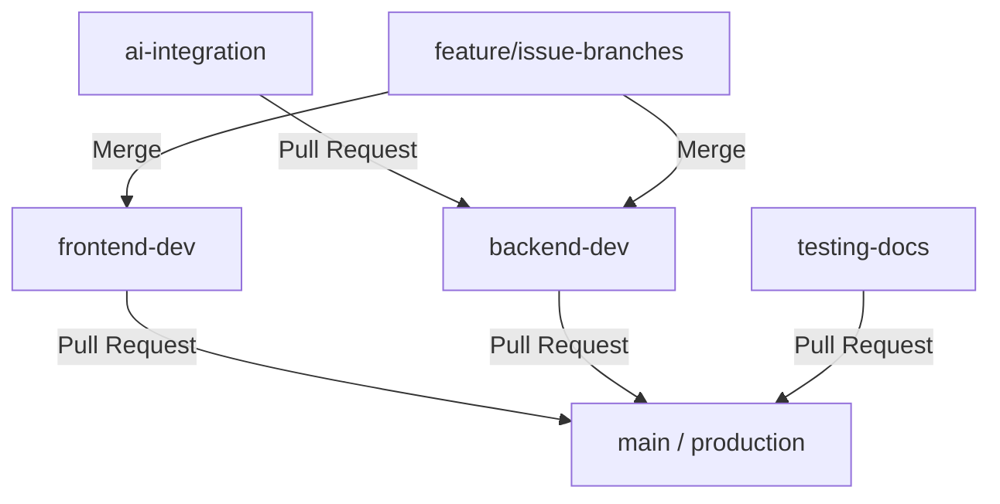

# Collaborative Git Workflow Guide

This document defines the professional branching strategy, workflow conventions, and pull request policies for our 4-member development team working on the **Smart Personalized AI Learning Platform**.

---

## 🌳 Branching Strategy

Our repository uses a structured branching strategy to isolate stable production code from active development:



### 1. Branch Roles

*   **`main` (Stable/Production)**:
    *   Contains fully tested, ready-to-deploy code.
    *   No direct commits allowed. All changes must arrive via approved Pull Requests from development branches.
*   **`frontend-dev` (Integration / Frontend)**:
    *   Integration branch for all frontend features.
    *   Frontend developers merge their individual feature branches here.
*   **`backend-dev` (Integration / Backend)**:
    *   Integration branch for the Express API, database migrations, and configurations.
    *   Backend developers merge their individual feature branches here.
*   **`ai-integration` (Feature Integration)**:
    *   Dedicated to Large Language Model (Gemini/OpenAI) prompt updates, key rotation schemes, and YouTube v3 API service refinements.
    *   Merges into `backend-dev` once tests pass.
*   **`testing-docs` (QA & Reports)**:
    *   Dedicated to writing QA unit/integration test suites, reports, and system documents.
    *   Merges directly into `main` after major milestones are verified.

---

## 🛠️ Feature Development Flow (For Developers)

To build a new feature or fix a bug, follow these steps:

### 1. Create a Feature Branch
Create your branch locally from the corresponding development branch (e.g., `frontend-dev` or `backend-dev`):
```bash
git checkout frontend-dev
git pull origin frontend-dev
git checkout -b feature/login-page-animation
```

### 2. Work on your Changes
Write clean code, follow style guidelines, and make atomic commits:
```bash
git add .
git commit -m "feat: add entry fade-in transitions for AuthPage"
```

### 3. Push and Open a Pull Request (PR)
Push your feature branch to GitHub:
```bash
git push -u origin feature/login-page-animation
```
Open a Pull Request on GitHub targeting either `frontend-dev` or `backend-dev`.

---

## 📋 Pull Request (PR) & Review Policies

To maintain code quality, the following rules apply to all Pull Requests:

1.  **Peer Reviews Required**:
    *   At least **1 approved review** is required from another team member before any PR can be merged into `frontend-dev`, `backend-dev`, or `main`.
2.  **No Conflicts**:
    *   PRs must have no merge conflicts. Resolve conflicts locally by pulling the target branch and merging it into your feature branch before pushing.
3.  **Automated Checks (CI)**:
    *   All automated tests must pass. For frontend, the application must build successfully (`npm run build:frontend`). For backend, all 18 integration tests must pass (`npm run test --prefix backend`).
4.  **Deletions**:
    *   Once a feature branch is merged, delete the branch on GitHub to keep the repository clean.

---

## 👥 4-Member Team Workflow Matrix

Here is the suggested division of roles and review partnerships:

| Member Role | Primary Focus Area | Target Branches | Primary Code Reviewer |
| :--- | :--- | :--- | :--- |
| **Frontend Dev 1** | UI Components & Routing | `frontend-dev` | Frontend Dev 2 |
| **Frontend Dev 2** | State, Charts & Animations | `frontend-dev` | Frontend Dev 1 |
| **Backend Dev** | Database & Express API Router | `backend-dev` | AI Dev / Tech Lead |
| **AI/QA Specialist** | Gemini Integrations & Test Suites | `ai-integration`, `testing-docs` | Backend Dev |
